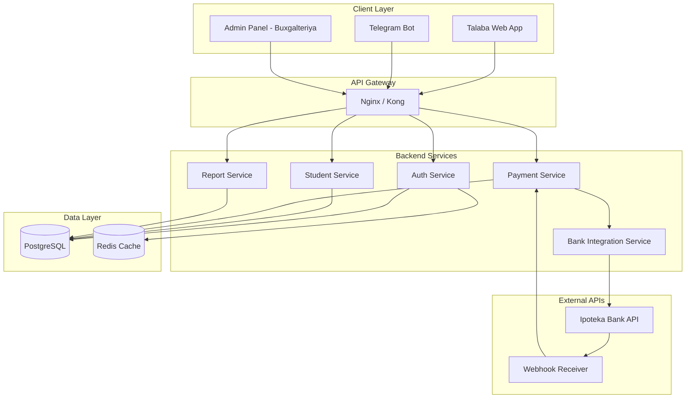
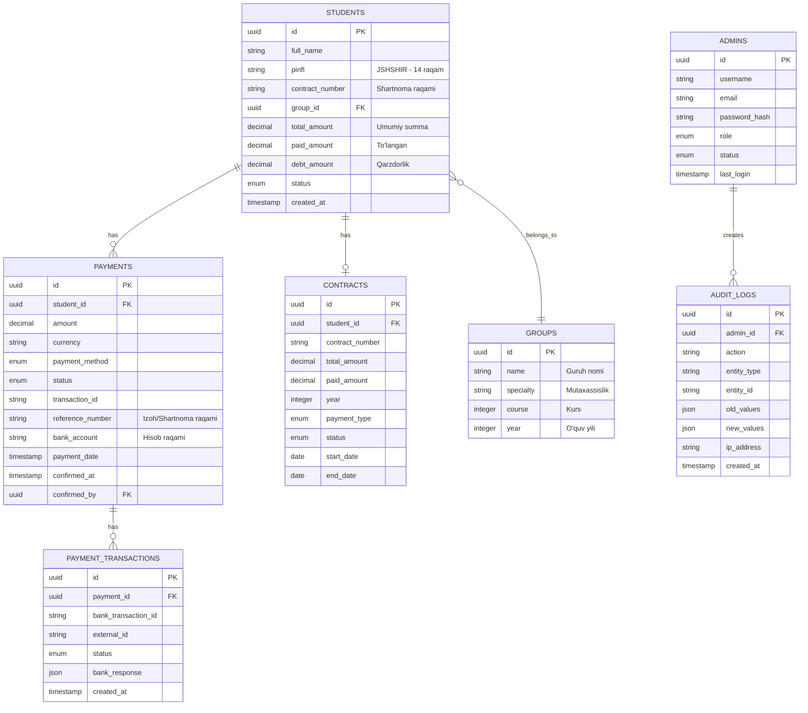
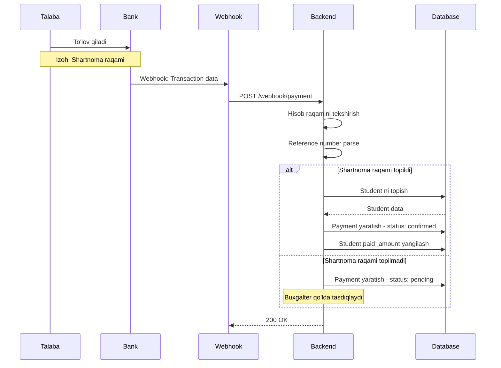
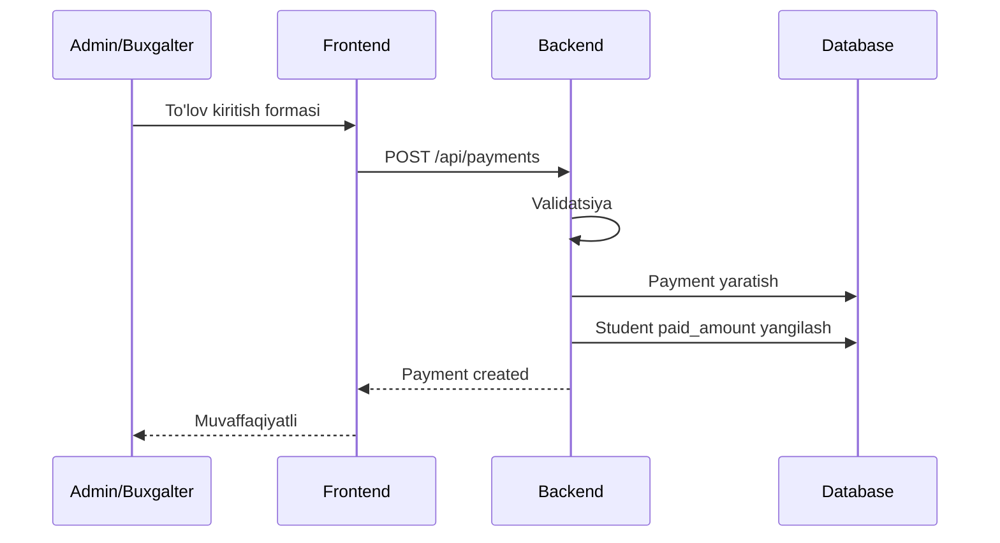

# Tibbiyot Texnikumi Moliyaviy Tizimi - Texnik Topshiriq

## 📋 Loyiha Haqida

Tibbiyot texnikumi buxgalteriyasi uchun moliyaviy monitoring tizimi. Talabalar kontrakt to'lovlarini kuzatish, tahlil qilish va boshqarish imkoniyatini beradi.

---

## 🎯 Asosiy Bloklar

### A. Talaba Paneli (Web yoki Telegram Bot)

| Funksiya | Tavsif |
|----------|--------|
| **Identifikatsiya** | PINFL yoki shartnoma raqami orqali kirish |
| **Balans** | Umumiy shartnoma summasi, to'langan summa, qolgan qarzdorlik |
| **Tarix** | Barcha to'lovlarning sanasi va miqdori |
| **Kvitansiya** | To'lov tasdiqlanganidan keyin PDF formatda yuklab olish |

### B. Admin Panel (Buxgalteriya uchun)

| Funksiya | Tavsif |
|----------|--------|
| **Dashboard** | Bugungi tushumlar, oylik reja va jami tushgan pullar grafigi |
| **Talabalar bazasi** | Talabalarni guruhlarga bo'lib boshqarish, yangi talaba qo'shish (Import Excel) |
| **To'lovlarni tasdiqlash** | Bankdan ma'lumot kelsa - avtomat, aks holda - qo'lda (manual) kiritish |

### C. Bank Integratsiyasi (Ipoteka Bank)

| Funksiya | Tavsif |
|----------|--------|
| **Webhook/API** | Bankdan kelayotgan har bir tranzaksiyani tutib olish |
| **Filtrlash** | Faqat mazkur texnikum hisob raqamiga tushgan pullarni ajratib olish |

---

## 🏗️ Tizim Arxitekturasi

### Umumiy Arxitektura



---

## 📊 Ma'lumotlar Bazasi Strukturasi

### ER Diagram



### Asosiy Jadval Tuzilmalari

#### students
```sql
CREATE TABLE students (
    id UUID PRIMARY KEY DEFAULT gen_random_uuid(),
    full_name VARCHAR(255) NOT NULL,
    pinfl VARCHAR(14) UNIQUE NOT NULL,
    contract_number VARCHAR(50) UNIQUE,
    group_id UUID REFERENCES groups(id),
    total_amount DECIMAL(15,2) DEFAULT 0,
    paid_amount DECIMAL(15,2) DEFAULT 0,
    debt_amount DECIMAL(15,2) GENERATED ALWAYS AS (total_amount - paid_amount) STORED,
    status VARCHAR(20) DEFAULT 'active',
    phone VARCHAR(20),
    created_at TIMESTAMP DEFAULT CURRENT_TIMESTAMP,
    updated_at TIMESTAMP DEFAULT CURRENT_TIMESTAMP
);
```

#### payments
```sql
CREATE TABLE payments (
    id UUID PRIMARY KEY DEFAULT gen_random_uuid(),
    student_id UUID REFERENCES students(id),
    amount DECIMAL(15,2) NOT NULL,
    currency VARCHAR(3) DEFAULT 'UZS',
    payment_method VARCHAR(50),
    status VARCHAR(20) DEFAULT 'pending',
    transaction_id VARCHAR(100),
    reference_number VARCHAR(255),
    bank_account VARCHAR(50),
    payment_date TIMESTAMP,
    confirmed_at TIMESTAMP,
    confirmed_by UUID REFERENCES admins(id),
    created_at TIMESTAMP DEFAULT CURRENT_TIMESTAMP
);
```

#### admins
```sql
CREATE TABLE admins (
    id UUID PRIMARY KEY DEFAULT gen_random_uuid(),
    username VARCHAR(100) UNIQUE NOT NULL,
    email VARCHAR(255) UNIQUE,
    password_hash VARCHAR(255) NOT NULL,
    role VARCHAR(20) DEFAULT 'accountant',
    status VARCHAR(20) DEFAULT 'active',
    last_login TIMESTAMP,
    created_at TIMESTAMP DEFAULT CURRENT_TIMESTAMP
);
```

---

## 🔄 To'lov Jarayoni

### Avtomatik To'lov Tasdiqlash



### Qo'lda To'lov Kiritish



---

## 🤖 Telegram Bot Arxitekturasi

### Bot Flow

```mermaid
graph TB
    A[/start] --> B{PINFL yoki Shartnoma?}
    B -->|PINFL| C[PINFL ni kiritish]
    B -->|Shartnoma| D[Shartnoma raqamini kiritish]
    
    C --> E{Talaba topildimi?}
    D --> E
    
    E -->|Ha| F[Asosiy Menu]
    E -->|Yo'q| G[Xatolik xabari]
    
    F --> H[📊 Balans]
    F --> I[📜 To'lov tarixi]
    F --> J[📄 Kvitansiya]
    
    H --> K[Umumiy: X so'm<br/>To'langan: Y so'm<br/>Qarzdorlik: Z so'm]
    I --> L[To'lovlar ro'yxati]
    L --> M[Tanlangan to'lov]
    M --> J
```

### Bot Komandalari

| Komanda | Tavsif |
|---------|--------|
| `/start` | Botni boshlash, identifikatsiya |
| `/balance` | Joriy balansni ko'rish |
| `/history` | To'lov tarixi |
| `/receipt` | Oxirgi to'lov kvitansiyasi |
| `/help` | Yordam |

---

## 🎨 Frontend Arxitekturasi

### Texnologiyalar
- **Framework**: React 18+ / Next.js 14
- **UI Library**: Ant Design / Material-UI
- **State Management**: Redux Toolkit / Zustand
- **Charts**: Recharts / Chart.js
- **Forms**: React Hook Form + Zod

### Sahifalar Strukturasi

```
frontend/
├── src/
│   ├── pages/
│   │   ├── auth/
│   │   │   ├── Login.tsx
│   │   │   └── ForgotPassword.tsx
│   │   ├── dashboard/
│   │   │   └── AccountantDashboard.tsx
│   │   ├── students/
│   │   │   ├── StudentList.tsx
│   │   │   ├── StudentDetail.tsx
│   │   │   └── StudentImport.tsx
│   │   ├── payments/
│   │   │   ├── PaymentList.tsx
│   │   │   ├── PaymentDetail.tsx
│   │   │   └── ManualPayment.tsx
│   │   └── reports/
│   │       ├── DailyReport.tsx
│   │       └── MonthlyReport.tsx
│   ├── components/
│   │   ├── dashboard/
│   │   │   ├── StatsCard.tsx
│   │   │   ├── RevenueChart.tsx
│   │   │   └── RecentPayments.tsx
│   │   ├── students/
│   │   │   ├── StudentTable.tsx
│   │   │   └── StudentFilter.tsx
│   │   └── payments/
│   │       ├── PaymentTable.tsx
│   │       └── PaymentStatus.tsx
│   └── services/
│       ├── api.ts
│       ├── authService.ts
│       ├── studentService.ts
│       └── paymentService.ts
```

### Dashboard Widgetlari

```typescript
interface DashboardData {
  // Bugungi statistika
  todayPayments: number;
  todayCount: number;
  
  // Oylik statistika
  monthlyPlan: number;
  monthlyActual: number;
  monthlyPercent: number;
  
  // Umumiy
  totalStudents: number;
  totalDebt: number;
  
  // Grafiklar
  revenueChart: DailyRevenue[];
  groupDebts: GroupDebt[];
  
  // So'nggi to'lovlar
  recentPayments: Payment[];
}
```

---

## ⚙️ Backend Arxitekturasi

### Texnologiyalar
- **Runtime**: Node.js 20+ / Python 3.11+
- **Framework**: NestJS / FastAPI
- **ORM**: Prisma / SQLAlchemy
- **Database**: PostgreSQL 15
- **Cache**: Redis
- **Queue**: BullMQ / Celery

### Modullar Strukturasi

```
backend/
├── src/
│   ├── modules/
│   │   ├── auth/
│   │   │   ├── auth.controller.ts
│   │   │   ├── auth.service.ts
│   │   │   └── dto/
│   │   ├── students/
│   │   │   ├── students.controller.ts
│   │   │   ├── students.service.ts
│   │   │   └── dto/
│   │   ├── payments/
│   │   │   ├── payments.controller.ts
│   │   │   ├── payments.service.ts
│   │   │   └── dto/
│   │   ├── reports/
│   │   │   ├── reports.controller.ts
│   │   │   └── reports.service.ts
│   │   ├── bank-integration/
│   │   │   ├── ipoteka-bank.service.ts
│   │   │   ├── webhook.controller.ts
│   │   │   └── dto/
│   │   └── telegram-bot/
│   │       ├── bot.module.ts
│   │       ├── bot.service.ts
│   │       └── handlers/
│   ├── common/
│   │   ├── guards/
│   │   ├── interceptors/
│   │   └── decorators/
│   └── config/
│       ├── database.config.ts
│       └── bank.config.ts
└── prisma/
    └── schema.prisma
```

### Webhook Controller

```typescript
// webhook.controller.ts
@Controller('webhook')
export class WebhookController {
  constructor(
    private readonly bankService: IpotekaBankService,
    private readonly paymentsService: PaymentsService,
  ) {}

  @Post('payment')
  async handlePayment(@Body() payload: BankWebhookDto) {
    // 1. Hisob raqamini tekshirish
    if (!this.isOurAccount(payload.accountNumber)) {
      return { status: 'ignored' };
    }

    // 2. Reference number dan shartnoma raqamini ajratib olish
    const contractNumber = this.extractContractNumber(payload.reference);

    // 3. Talabani topish
    const student = await this.findStudent(contractNumber, payload.pinfl);

    // 4. Payment yaratish
    const payment = await this.paymentsService.create({
      amount: payload.amount,
      studentId: student?.id,
      status: student ? 'confirmed' : 'pending',
      transactionId: payload.transactionId,
      referenceNumber: payload.reference,
    });

    return { status: 'success', paymentId: payment.id };
  }
}
```

---

## 🔐 Xavfsizlik

### Muhim Tavsiyalar

| Tavsiya | Tavsif |
|---------|--------|
| **Pul yechish yo'q** | Platforma faqat ko'rish (monitoring) uchun |
| **ID tizimi** | Talabalar to'lov qilayotganda izohga shartnoma raqamini yozish |
| **IP Whitelist** | Server IP manzilini bank tizimiga kiritish |
| **API Key** | Ma'lumotlar almashinuvi xavfsizligi uchun |

### Autentifikatsiya

- ✅ JWT Token (Admin panel)
- ✅ PINFL/Shartnoma (Talaba paneli)
- ✅ Telegram ID (Telegram Bot)
- ✅ Role-based access control (RBAC)

---

## 📞 Bank Bilan Bog'lanish

### So'raladigan Ma'lumotlar

| Ma'lumot | Tavsif |
|----------|--------|
| **Merchant ID** | Texnikumning bankdagi identifikatori |
| **API Key / Secret Key** | Ma'lumotlar almashinuvi xavfsizligi uchun |
| **IP Whitelist** | Server IP manzilini bank tizimiga kiritish |
| **Webhook URL** | Bankdan to'lov ma'lumotlarini qabul qilish uchun |

### Rasmiy Xat Namunasi

```
Ipoteka Bankning [filial nomi] filialiga

Tibbiyot texnikumi nomidan

ARIZA

Mazkur ariza orqali Tibbiyot texnikumi uchun talabalar kontrakt 
to'lovlarini avtomatik monitoring qilish maqsadida API xizmatini 
yoqishni so'raymiz.

So'raladigan ma'lumotlar:
1. Merchant ID
2. API Key / Secret Key
3. Webhook URL ni ro'yxatdan o'tkazish
4. Server IP manzilini whitelist ga qo'shish

Aloqa uchun: [telefon, email]

Imzo: _______________
Sana: _______________
```

---

## 🚀 Implementatsiya Bosqichlari

### Phase 1: Asosiy Tizim
- [ ] Backend asosiy strukturasi
- [ ] Database migratsiyalari
- [ ] Auth moduli (Admin)
- [ ] Student CRUD + Excel Import
- [ ] Payment CRUD
- [ ] Admin Panel Dashboard

### Phase 2: Talaba Paneli
- [ ] Talaba identifikatsiyasi (PINFL/Shartnoma)
- [ ] Balans ko'rish
- [ ] To'lov tarixi
- [ ] PDF Kvitansiya

### Phase 3: Telegram Bot
- [ ] Bot asosiy strukturasi
- [ ] Identifikatsiya
- [ ] Balans va tarix
- [ ] Kvitansiya yuborish

### Phase 4: Bank Integratsiyasi
- [ ] Ipoteka Bank API integratsiyasi
- [ ] Webhook receiver
- [ ] Avtomatik to'lov tasdiqlash
- [ ] Error handling

### Phase 5: Hisobotlar
- [ ] Kunlik hisobot
- [ ] Oylik hisobot
- [ ] Excel eksport
- [ ] Grafiklar va tahlil

---

## 📁 Loyiha Strukturasi

```
financial-system/
├── frontend/                 # React/Next.js frontend
│   ├── src/
│   ├── public/
│   └── Dockerfile
├── backend/                  # NestJS backend
│   ├── src/
│   ├── prisma/
│   └── Dockerfile
├── telegram-bot/             # Telegram bot
│   ├── src/
│   └── Dockerfile
├── docs/                     # Hujjatlar
├── docker-compose.yml
├── .env.example
└── README.md
```

---

## 📊 Foydalanuvchi Rollari

| Rol | Huquqlar |
|-----|----------|
| **Admin** | Barcha huquqlar, foydalanuvchi boshqaruvi |
| **Buxgalter** | To'lovlarni ko'rish, tasdiqlash, hisobotlar |
| **Operator** | Talaba qo'shish, ma'lumotlarni tahrirlash |
| **Talaba** | O'z to'lovlarini ko'rish, kvitansiya yuklash |

---

## ⚠️ Muhim Eslatmalar

1. **Monitoring Only**: Platforma faqat ko'rish uchun, pul yechish funksiyasi yo'q
2. **ID Tizimi**: Talabalarga to'lov qilayotganda izohga shartnoma raqamini yozishni o'rgatish
3. **String Matching**: Reference number dan shartnoma raqamini topish algoritmi
4. **Manual Backup**: Avtomatik tasdiqlanmagan to'lovlar uchun buxgalter tasdiqlashi
